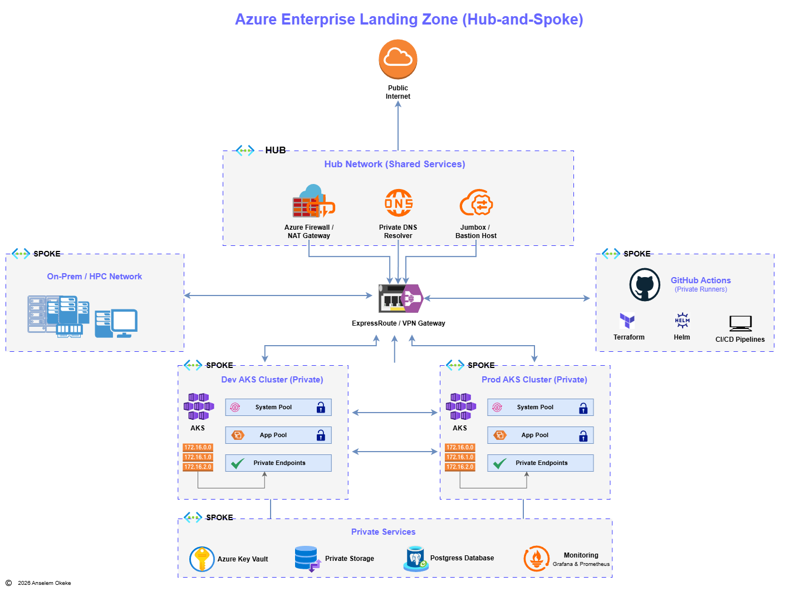
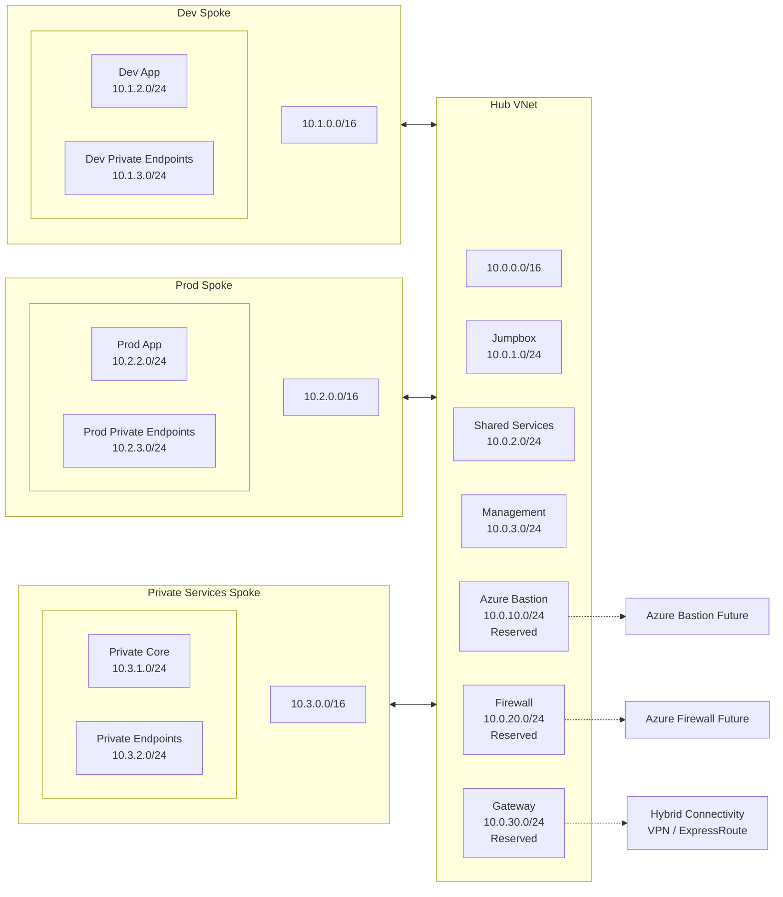
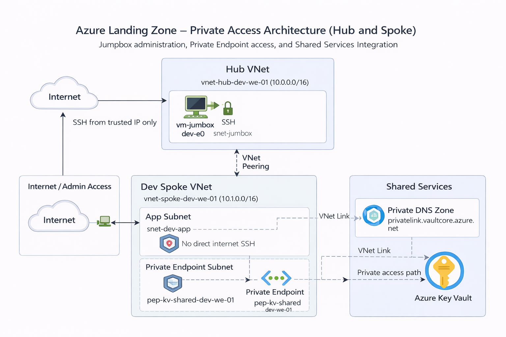
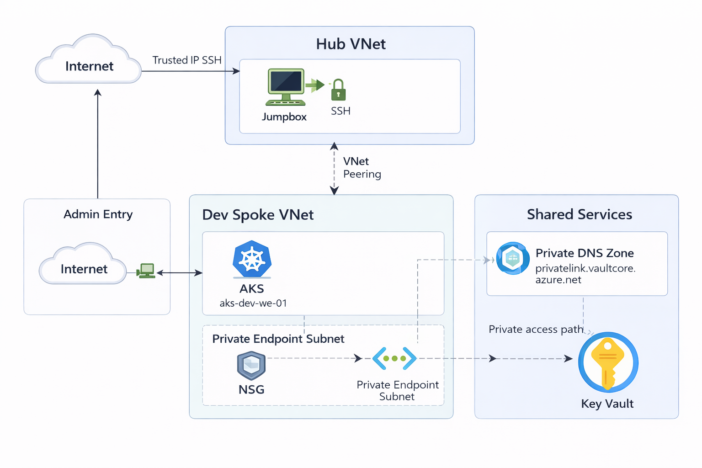
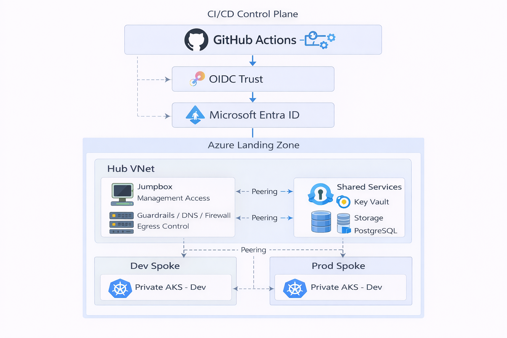

# Azure Enterprise Landing Zone Architecture



## Overview

This project defines an Azure enterprise-style landing zone based on a hub-and-spoke network architecture.

The design separates shared platform services from workload environments and provides a foundation for secure, scalable, and governable cloud deployments.

The target state includes:
- a central hub network for shared services and administrative access
- isolated spokes for development and production workloads
- a private services zone for internal platform dependencies
- a future CI/CD spoke for private runners and delivery tooling
- a future hybrid connectivity boundary for on-premises or HPC integration

This repository follows a phased approach:
- Phase 1: low-cost proof of concept
- Phase 2: enterprise expansion

## Architecture Objectives

The architecture is designed to achieve the following goals:

- separate shared services from workload networks
- support secure administrative access
- create clear isolation between dev and prod environments
- prepare for private service connectivity
- support future hybrid connectivity patterns
- enable phased implementation with Terraform
- keep the initial deployment cost low during the proof-of-concept stage

## Network Plan



## Summary Table

| Zone | VNet CIDR | Subnet | CIDR | Purpose |
|---|---|---|---|---|
| Hub | `10.0.0.0/16` | `snet-jumpbox` | `10.0.1.0/24` | Admin access VM |
| Hub | `10.0.0.0/16` | `snet-shared-services` | `10.0.2.0/24` | Shared platform services |
| Hub | `10.0.0.0/16` | `snet-management` | `10.0.3.0/24` | Future management services |
| Hub | `10.0.0.0/16` | `snet-azurebastion` | `10.0.10.0/24` | Reserved |
| Hub | `10.0.0.0/16` | `snet-firewall` | `10.0.20.0/24` | Reserved |
| Hub | `10.0.0.0/16` | `snet-gateway` | `10.0.30.0/24` | Reserved |
| Dev | `10.1.0.0/16` | `snet-dev-system` | `10.1.1.0/24` | Future platform components |
| Dev | `10.1.0.0/16` | `snet-dev-app` | `10.1.2.0/24` | App workloads |
| Dev | `10.1.0.0/16` | `snet-dev-private-endpoints` | `10.1.3.0/24` | Private endpoint usage |
| Prod | `10.2.0.0/16` | `snet-prod-system` | `10.2.1.0/24` | Future platform components |
| Prod | `10.2.0.0/16` | `snet-prod-app` | `10.2.2.0/24` | App workloads |
| Prod | `10.2.0.0/16` | `snet-prod-private-endpoints` | `10.2.3.0/24` | Private endpoint usage |
| Private Services | `10.3.0.0/16` | `snet-private-core` | `10.3.1.0/24` | Core internal services |
| Private Services | `10.3.0.0/16` | `snet-private-endpoints` | `10.3.2.0/24` | Private endpoint usage |
| CI/CD | `10.4.0.0/16` | `snet-runners` | `10.4.1.0/24` | Private runners |
| CI/CD | `10.4.0.0/16` | `snet-build-agents` | `10.4.2.0/24` | Build/deploy agents |

## Why Hub-and-Spoke

A hub-and-spoke model is used to centralize shared services while keeping workloads isolated in dedicated spoke networks.

This pattern allows:
- shared network services to be placed in one central location
- workload environments to be separated by purpose and risk
- future security controls to be introduced without redesigning the full topology
- clearer operational boundaries between platform infrastructure and hosted applications

In this project, the hub acts as the shared platform network, while each spoke represents a dedicated environment or service domain.

## Hub Network

The hub network is the shared platform zone.

### Purpose
The hub is responsible for central platform connectivity and shared operational services.

### Current PoC role
In Phase 1, the hub contains only the minimum components needed to validate the design:
- hub virtual network
- administrative access subnet
- shared services subnet placeholder
- small Linux jumpbox for controlled access

### Future enterprise role
In a later phase, the hub may also contain:
- Azure Firewall or centralized egress controls
- NAT Gateway
- Private DNS Resolver
- Bastion or hardened administrative access services
- VPN Gateway or ExpressRoute integration
- shared monitoring or platform tooling

## Spoke Networks

### Dev Spoke
The development spoke represents non-production application workloads.

Its purpose is to host development-stage services with clear separation from production resources.

Future examples:
- private AKS development cluster
- internal application services
- development-only dependencies

### Prod Spoke
The production spoke represents production application workloads.

Its purpose is to provide stronger isolation for business-critical services and production deployments.

Future examples:
- private AKS production cluster
- production application services
- production-grade access controls

### Private Services Spoke
The private services spoke represents shared internal platform services that should not be publicly exposed.

Examples include:
- Azure Key Vault
- private storage access
- private database access
- internal service endpoints

In Phase 1, this spoke may be represented by a single private service example such as Key Vault or Storage with private connectivity.

### CI/CD Spoke
The CI/CD spoke is reserved for future private delivery tooling.

Examples include:
- GitHub Actions private runners
- Terraform execution workers
- deployment agents
- internal build or release tooling

This spoke is design-only in the current phase.

### On-Prem / HPC Connectivity Zone
This zone represents a future hybrid connectivity boundary.

It is included in the target architecture to show how external enterprise networks could connect into the landing zone through controlled connectivity.

Examples include:
- on-premises datacenter connectivity
- VPN-based branch connectivity
- HPC or internal compute network integration

## Trust Boundaries

The architecture is divided into multiple trust zones.

### Hub trust boundary
The hub is trusted for shared platform services but should remain tightly controlled because compromise of the hub can affect multiple spokes.

### Dev trust boundary
The development spoke is lower-trust than production and should be isolated to prevent accidental or insecure development activity from affecting production services.

### Prod trust boundary
The production spoke is a higher-trust and higher-protection zone. Access should be restricted and tightly governed.

### Private services trust boundary
Private platform services should only be reachable through approved private connectivity paths and should never rely on broad public exposure by default.

### Hybrid boundary
External or on-premises connectivity is treated as a separate trust domain and must be explicitly controlled before access is allowed into hub or spoke networks.

## High-Level Traffic and Access Model

The intended traffic model is as follows:

- administrative access enters through the hub
- shared services are centralized in the hub
- workload hosting occurs in spokes
- private services are consumed through controlled private connectivity
- development and production spokes remain logically separated
- hybrid or external connectivity is introduced only through controlled boundary services

### Phase 1 access model
During the proof of concept:
- one Linux jumpbox is used for administrative access
- one hub and one spoke are deployed
- one private service example is added
- connectivity is validated through simple hub-to-spoke design

### Future access model
In the enterprise phase:
- bastion or hardened access paths may replace the jumpbox
- centralized firewall and DNS services may be added to the hub
- AKS clusters and private endpoints may be distributed across multiple spokes
- hybrid access may be introduced with VPN Gateway or ExpressRoute

## Phased Implementation

### Phase 1 - Proof of Concept
The first phase is intentionally limited in order to validate the architecture with minimal cost and complexity.

Included in Phase 1:
- documentation and target-state design
- Terraform repository structure
- hub virtual network
- one spoke virtual network
- virtual network peering
- one Linux jumpbox
- one private service example

### Phase 2 - Enterprise Expansion
The second phase extends the proof of concept toward a more complete enterprise landing zone.

Potential additions in Phase 2:
- Azure Firewall
- NAT Gateway
- Private DNS Resolver
- VPN Gateway or ExpressRoute
- dev private AKS cluster
- prod private AKS cluster
- CI/CD private runners spoke
- full private endpoint strategy
- centralized monitoring and security controls

## Project Status

### Target Architecture
The target architecture includes:
- hub shared services
- dev and prod AKS spokes
- private services
- CI/CD spoke
- hybrid/on-prem connectivity
- centralized security and DNS services

### Implemented in Phase 1
The current proof of concept includes:
- hub resource group
- dev spoke resource group
- shared services resource group
- hub VNet
- dev spoke VNet
- VNet peering
- secured jumpbox subnet
- shared services subnet
- dev app subnet
- dev private-endpoints subnet
- subnet NSGs
- Linux jumpbox VM
- Azure Key Vault
- private endpoint for Key Vault
- private DNS zone for Key Vault private link
- VNet links for private DNS
- hardened private Key Vault access path

## Why This Architecture

The design uses a hub-and-spoke model to separate shared platform services from workload environments.

### Hub responsibilities
- administrative entry point
- shared services
- future centralized controls

### Dev spoke responsibilities
- development workload boundary
- private endpoint consumption
- future AKS landing zone

### Shared services responsibilities
- internal platform services such as Key Vault
- private-access design pattern
- future shared service expansion

## Deployed Phase 1 Architecture


[comment]: <> (```mermaid)

[comment]: <> (flowchart LR)

[comment]: <> (    Internet&#40;&#40;Internet&#41;&#41;)

[comment]: <> (    subgraph HUB["Hub VNet: vnet-hub-dev-we-01 &#40;10.0.0.0/16&#41;"])

[comment]: <> (        JSubnet["snet-jumpbox"])

[comment]: <> (        SSubnet["snet-shared-services"])

[comment]: <> (        Jumpbox["vm-jumpbox-dev-we-01"])

[comment]: <> (        JNSG["NSG: nsg-jumpbox-dev-we-01\nSSH only from trusted IP"])

[comment]: <> (        JSubnet --> Jumpbox)

[comment]: <> (        JNSG --- JSubnet)

[comment]: <> (    end)

[comment]: <> (    subgraph DEV["Dev Spoke VNet: vnet-spoke-dev-we-01 &#40;10.1.0.0/16&#41;"])

[comment]: <> (        AppSubnet["snet-dev-app"])

[comment]: <> (        PESubnet["snet-dev-private-endpoints"])

[comment]: <> (        AppNSG["NSG: nsg-dev-app-dev-we-01\nDeny direct internet SSH"])

[comment]: <> (        PE["Private Endpoint:\npep-kv-shared-dev-we-01"])

[comment]: <> (        AppNSG --- AppSubnet)

[comment]: <> (        PESubnet --> PE)

[comment]: <> (    end)

[comment]: <> (    subgraph SHARED["Shared Services RG"])

[comment]: <> (        KV["Key Vault"])

[comment]: <> (        PDNS["Private DNS Zone:\nprivatelink.vaultcore.azure.net"])

[comment]: <> (    end)

[comment]: <> (    Internet -->|SSH from trusted IP only| Jumpbox)

[comment]: <> (    HUB <-->|VNet Peering| DEV)

[comment]: <> (    PE --> KV)

[comment]: <> (    PDNS --- PE)

[comment]: <> (    PDNS -. VNet Link .- HUB)

[comment]: <> (    PDNS -. VNet Link .- DEV)

[comment]: <> (    Jumpbox -. private DNS resolution path .-> PDNS)

[comment]: <> (    Jumpbox -. private access path .-> KV)

[comment]: <> (```)


---


```md
## Deployed Resources

### Resource Groups
- `rg-hub-network-dev`
- `rg-spoke-dev-network`
- `rg-shared-services-dev`

### Networking
- `vnet-hub-dev-we-01`
- `vnet-spoke-dev-we-01`
- `peer-hub-to-dev-we-01`
- `peer-dev-to-hub-we-01`

### Subnets
- `snet-jumpbox`
- `snet-shared-services`
- `snet-dev-app`
- `snet-dev-private-endpoints`

### Security
- `nsg-jumpbox-dev-we-01`
- `nsg-dev-app-dev-we-01`

### Compute
- `vm-jumpbox-dev-we-01`
- `nic-jumpbox-dev-we-01`
- `pip-jumpbox-dev-we-01`

### Private Services
- Azure Key Vault
- private endpoint for Key Vault
- private DNS zone: `privatelink.vaultcore.azure.net`
```
## Validation Performed

The following checks were completed during the Phase 1 implementation:

- resource groups created successfully
- hub and dev spoke VNets created successfully
- VNet peering connected and fully in sync
- subnet-level NSGs applied successfully
- jumpbox administrative access restricted to trusted public IP
- Key Vault private endpoint created successfully
- private DNS zone linked to both hub and dev spoke VNets
- Key Vault name resolution validated from the jumpbox
- Key Vault private access path validated
- Key Vault public network access disabled after validation

### AKS Validation

The AKS integration was validated using:
- successful AKS deployment in the dev spoke
- retrieval of AKS credentials with Azure CLI
- `kubectl get nodes`
- `kubectl get pods -A`
- This confirms that the landing zone now includes a functioning Kubernetes platform component in the development spoke.

### AKS Deployment Outputs
```shell
terraform output aks_dev_name
terraform output aks_dev_fqdn
terraform output aks_dev_node_resource_group
```

- cluster name: `aks-dev-we-01`
- node resource group: `aksdevwe01-wjhobhi8.hcp.westeurope.azmk8s.io`
- API endpoint: `MC_rg-spoke-dev-network_aks-dev-we-01_westeurope`

## Key Vault Secret Usage

The Key Vault is now used for more than private endpoint validation.

### Stored secrets
- runtime service principal client ID
- runtime service principal tenant ID
- runtime service principal client secret
- database connection placeholders

### Intended next use
The AKS cluster can later consume these secrets through Azure Key Vault integration, for example with the Secrets Store CSI Driver and identity-based access.

## Terraform Structure

```text
terraform/
├── envs/
│   └── dev/
├── modules/
│   ├── resource-group/
│   ├── network/
│   ├── vnet-peering/
│   ├── nsg/
│   ├── linux-vm/
│   ├── private-service-example/
│   └── private-dns/
```
---

## Implemented vs Future State

| Area | Current State | Future State |
|---|---|---|
| Hub network | Implemented | Expand with centralized controls |
| Dev spoke | Implemented | Extend further with workloads |
| Dev AKS | Implemented (single cluster) | Harden and expand |
| Prod spoke | Not implemented | Planned |
| Prod AKS | Not implemented | Planned |
| Jumpbox access | Implemented | Future Bastion option |
| Private service example | Implemented | Expand to more services |
| Private DNS for Key Vault | Implemented | Extend to other services |
| CI/CD spoke | Not implemented | Planned |
| Azure Firewall / NAT | Not implemented | Planned |
| VPN / ExpressRoute | Not implemented | Planned |
| Centralized monitoring/security | Not implemented | Planned |

## Deployed Architecture with AKS



[comment]: <> (```mermaid)

[comment]: <> (flowchart LR)

[comment]: <> (    Internet&#40;&#40;Internet&#41;&#41;)

[comment]: <> (    subgraph HUB["Hub VNet: vnet-hub-dev-we-01 &#40;10.0.0.0/16&#41;"])

[comment]: <> (        JSubnet["snet-jumpbox"])

[comment]: <> (        SSubnet["snet-shared-services"])

[comment]: <> (        Jumpbox["vm-jumpbox-dev-we-01"])

[comment]: <> (        JNSG["NSG: nsg-jumpbox-dev-we-01\nSSH only from trusted IP"])

[comment]: <> (        JSubnet --> Jumpbox)

[comment]: <> (        JNSG --- JSubnet)

[comment]: <> (    end)

[comment]: <> (    subgraph DEV["Dev Spoke VNet: vnet-spoke-dev-we-01 &#40;10.1.0.0/16&#41;"])

[comment]: <> (        AKSSubnet["snet-dev-aks-system"])

[comment]: <> (        AppSubnet["snet-dev-app"])

[comment]: <> (        PESubnet["snet-dev-private-endpoints"])

[comment]: <> (        AppNSG["NSG: nsg-dev-app-dev-we-01\nDeny direct internet SSH"])

[comment]: <> (        AKS["aks-dev-we-01"])

[comment]: <> (        PE["Private Endpoint:\npep-kv-shared-dev-we-01"])

[comment]: <> (        AKSSubnet --> AKS)

[comment]: <> (        AppNSG --- AppSubnet)

[comment]: <> (        PESubnet --> PE)

[comment]: <> (    end)

[comment]: <> (    subgraph SHARED["Shared Services RG"])

[comment]: <> (        KV["Key Vault"])

[comment]: <> (        PDNS["Private DNS Zone:\nprivatelink.vaultcore.azure.net"])

[comment]: <> (    end)

[comment]: <> (    Internet -->|SSH from trusted IP only| Jumpbox)

[comment]: <> (    Internet -.->|current AKS API access model| AKS)

[comment]: <> (    HUB <-->|VNet Peering| DEV)

[comment]: <> (    PE --> KV)

[comment]: <> (    PDNS --- PE)

[comment]: <> (    PDNS -. VNet Link .- HUB)

[comment]: <> (    PDNS -. VNet Link .- DEV)

[comment]: <> (    Jumpbox -. private DNS resolution .-> PDNS)

[comment]: <> (    Jumpbox -. private service access path .-> KV)

[comment]: <> (    AKS -. future private service consumption .-> KV)

[comment]: <> (```)

## Lessons Learned

- provider configuration must exist in the active Terraform root module
- subnet-to-NSG associations should use static keys in Terraform
- private endpoints require DNS integration to behave as expected
- private DNS linking is essential when clients live in different VNets
- phased implementation is more realistic than attempting full enterprise parity at once

## Next Steps

### Phase 1 complete
- networking foundation
- secured admin path
- private service pattern
- private DNS validation
- hardened Key Vault access

### Phase 2 initial expansion
- deploy one AKS cluster in the dev spoke
- integrate AKS with the spoke design
- add lightweight CI/CD validation workflow
- continue aligning deployed resources with the target architecture

## Evidence and Screenshots

[comment]: <> (Recommended screenshots to include:)

[comment]: <> (- Azure resource groups)

[comment]: <> (- deployed VNets)

[comment]: <> (- VNet peering status)

[comment]: <> (- NSGs and subnet associations)

[comment]: <> (- jumpbox VM)

[comment]: <> (- Key Vault private endpoint)

[comment]: <> (- private DNS zone and VNet links)

[comment]: <> (- Terraform apply outputs)


## Phase 2 Initial Expansion - AKS in the Dev Spoke

The first Phase 2 extension adds one AKS cluster into the development spoke.

### Implemented
- one AKS cluster in `rg-spoke-dev-network`
- one dedicated AKS node subnet: `snet-dev-aks-system`
- user-assigned identity for AKS
- subnet role assignment for cluster network operations

### Purpose
This extends the landing zone from a network and private-service proof of concept into a workload-platform proof of concept.

### Current scope
- one development AKS cluster only
- public API endpoint retained for simplicity
- no production AKS cluster yet
- no private AKS API yet
- no ingress/controller stack yet

### Future direction
- production AKS spoke
- private AKS access model or API Server VNet integration
- CI/CD integration
- centralized platform controls

### CI / CD Workflow


```md
Developer pushes code
        │
        ▼
GitHub Actions Runner
        │
        │ OIDC token request
        ▼
GitHub OIDC Provider
        │
        ▼
Microsoft Entra ID
        │
   Federated Credential
        │
        ▼
Service Principal Identity
        │
        ▼
Azure RBAC
        │
        ▼
Terraform deploys infrastructure
```


## Summary

This landing zone is designed as a phased Azure platform foundation.

The target architecture reflects an enterprise-style hub-and-spoke model, while the initial implementation focuses on a low-cost proof of concept that validates the most important design elements without attempting full-scale deployment too early.

The result is a design that is both realistic for a trial subscription and extensible toward a more complete private platform architecture.
