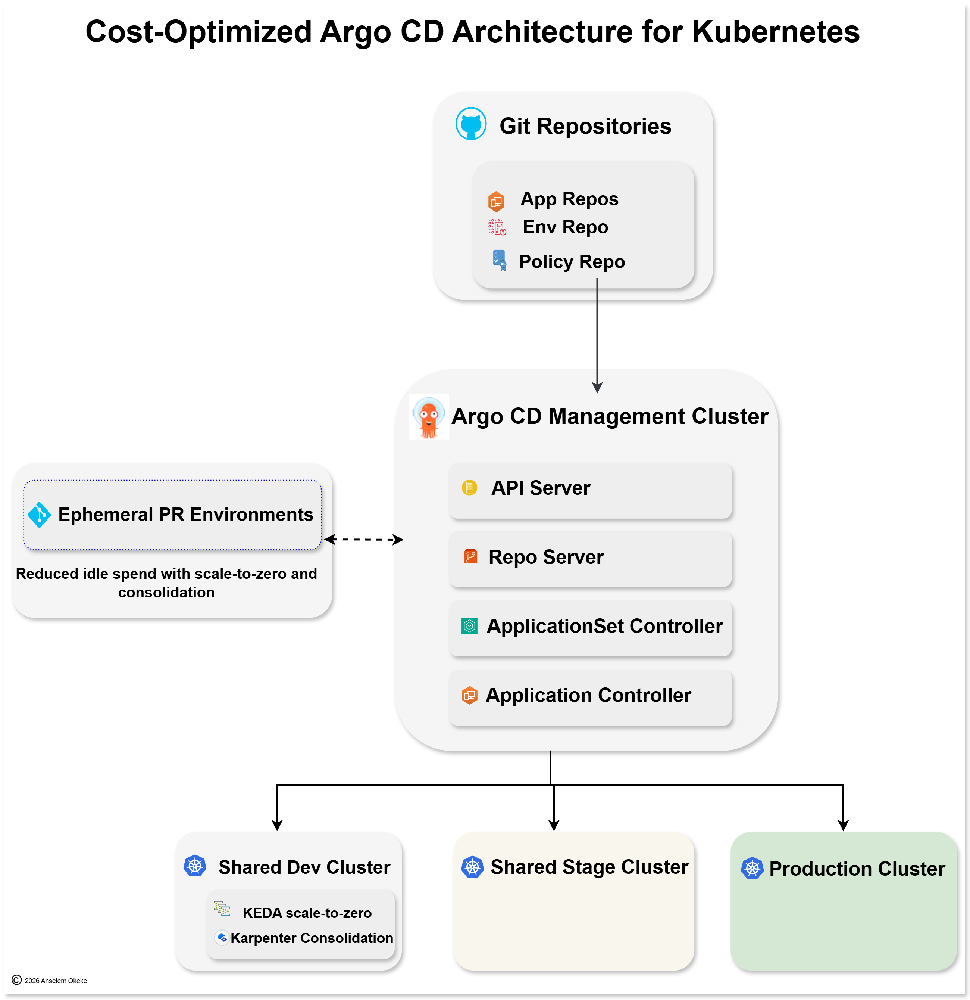

# Cost-Optimized Argo CD Multi-Cluster Architecture
## Executive Backup Document for the Architecture Diagram

**Purpose of this document**  
This document explains the architecture shown in the diagram step by step, with special emphasis on:

- what each component does
- why it exists
- what business or engineering problem it solves
- where cost is optimized
- what trade-offs leadership should understand

This document is intended to serve as:

- a backup document for the architecture image
- a knowledge base for CTOs, Managers, Company owners, and Engineering leaders
- a technical talking point reference for Architecture reviews, and Platform Planning

---

# 1. Executive Summary

Most companies do not have only a deployment problem.  
They often have a **platform waste problem**.

Typical waste patterns include:

- too many clusters
- too many always-on non-production environments
- duplicated GitOps tooling
- underutilized nodes
- preview environments that remain alive even when nobody is reviewing changes
- too much engineering time spent maintaining duplicated platform layers

This architecture addresses those problems by combining:

- **Git as the source of truth**
- **a central Argo CD management layer**
- **shared non-production environments**
- **ephemeral PR environments**
- **elastic scaling controls in the right places**
- **production isolation for controlled releases**

The result is a platform model that is not just cloud-native, but **financially disciplined cloud-native**.

---

# 2. What Problem This Architecture Solves

This architecture is designed to solve four categories of problems.

## 2.1 Deployment problems

Without a structured GitOps model, organizations often suffer from:

- manual deployments
- inconsistent release methods
- weak rollback processes
- low visibility into who changed what
- configuration drift between environments

## 2.2 Cost problems

Without intentional environment design, organizations often create:

- too many clusters
- too many duplicated add-ons
- too many idle non-prod workloads
- too many always-on preview environments
- underutilized compute capacity

## 2.3 Governance problems

Without central deployment governance, organizations often face:

- direct manual changes in clusters
- weak separation of duties
- inconsistent environment standards
- poor auditability
- policy drift

## 2.4 Platform operations problems

Without simplification, teams spend too much effort on:

- upgrading duplicated environments
- monitoring repeated tooling stacks
- troubleshooting similar problems in too many places
- keeping access and RBAC aligned everywhere

---

# 3. High-Level Architecture Overview

The architecture has five major layers:

1. **Git Repositories**  
   - The source of truth for application, environment, and policy definitions.

2. **Argo CD Management Cluster**  
   - The centralized GitOps control layer that continuously reconciles desired and actual state.

3. **Shared Dev Cluster**  
   - A low-cost, elastic non-production cluster used by multiple teams for fast iteration.

4. **Shared Stage Cluster**  
   - A controlled pre-production environment used for validation before production.

5. **Ephemeral PR Environments + Production**  
   - Temporary review environments for pull requests, and a separate production environment for live workloads.

---

# 4. Important Clarification: “Control Plane” Means Two Different Things

One of the most common misunderstandings is the phrase **control plane**.

## 4.1 Kubernetes control plane

Every Kubernetes cluster has its own native Kubernetes control plane by default, including:

- API server
- scheduler
- controller manager
- etcd or managed equivalent

This is required for the cluster itself to function.

## 4.2 Argo CD management/control plane

In this architecture, when we say **Argo CD Management Cluster**, we mean:

- Argo CD API Server
- Repo Server
- Application Controller
- ApplicationSet Controller
- optional Argo CD UI and supporting services

This does **not** replace the Kubernetes control plane in other target clusters.

### Why this distinction matters

The architecture does **not** remove Kubernetes control planes from target clusters.  
What it centralizes is the **GitOps tool layer**, not Kubernetes itself.

---

# 5. Architecture Flow Step by Step

## Step 1: Engineers change code or configuration in Git

Changes are made in repositories that hold:

- application manifests
- environment-specific overlays or values
- policy and governance definitions

## Step 2: Argo CD detects changes

Argo CD watches the configured repositories and detects a new desired state.

## Step 3: Argo CD renders and compares

Argo CD pulls the repository content, renders manifests if necessary, and compares:

- desired state in Git
- actual state in the cluster

## Step 4: Argo CD reconciles drift

If a difference exists, Argo CD syncs the target environment back to the declared state.

## Step 5: Applications land in the correct environment

Based on environment logic and application definitions, the workload is deployed to:

- shared dev
- shared stage
- ephemeral PR environment
- production

## Step 6: Cost controls apply where appropriate

Cost optimization is applied differently by environment:

- **Dev**: more aggressive optimization
- **Stage**: moderate optimization, closer to production behavior
- **PR Environments**: temporary by design
- **Production**: stability first, cost second

---

# 6. Component-by-Component Deep Dive

# 6.1 Git Repositories

The diagram shows three repository categories:

- App Repos
- Env Repo
- Policy Repo

## 6.1.1 App Repos

### What they contain

- deployment manifests
- Helm charts
- Kustomize bases
- service definitions
- ingress definitions
- configmaps
- application-specific configuration

### Why they exist

App repos store the application deployment definition close to the application lifecycle.

### What problem they solve

They reduce:

- undocumented deployment changes
- app-specific drift
- manual deployment behavior

### Cost relevance

Indirectly, app repos reduce cost by:

- reducing rework
- improving rollback
- shortening troubleshooting
- lowering the human cost of inconsistent deployments

---

## 6.1.2 Env Repo

### What it contains

- dev/stage/prod values
- replica differences
- domain differences
- environment-specific resource settings
- overlays for each target environment

### Why it exists

Different environments usually need different settings, but not completely separate application definitions.

### What problem it solves

It prevents:

- duplication of nearly identical manifests
- copy-paste configuration sprawl
- environment inconsistencies

### Cost relevance

The env repo reduces:

- configuration duplication
- maintenance effort
- risk of misconfiguration that leads to downtime or rework

---

## 6.1.3 Policy Repo

### What it contains

- guardrails
- baseline security policy
- RBAC patterns
- network standards
- admission or governance policies
- platform defaults

### Why it exists

Policies change at a different pace than application code and should be managed as their own discipline.

### What problem it solves

It reduces:

- inconsistent governance
- uncontrolled cluster behavior
- policy drift between environments

### Cost relevance

Policy standardization reduces:

- incident cost
- audit complexity
- rework caused by inconsistent standards

---

# 6.2 Argo CD Management Cluster

This is the central GitOps management layer.

## Why a separate management cluster exists

Instead of deploying a full Argo CD stack into every target cluster, this architecture uses a dedicated cluster for Argo CD resources.

### What problem this solves

It reduces:

- duplicated GitOps tooling
- repeated upgrades
- repeated monitoring
- repeated troubleshooting
- repeated Argo CD access management

### Cost optimization angle

This is a **tooling duplication reduction strategy**.

It does not remove the native Kubernetes control plane of target clusters.  
It prevents the business from operating multiple full Argo CD stacks when one can govern many environments.

---

## 6.2.1 Argo CD API Server

### What it does

- exposes the UI/API/CLI endpoint
- provides visibility into sync status
- allows controlled operational access

### Why it exists

Teams need a central operational interface for GitOps state and application health.

### Problem it solves

Without it, operators may rely too much on manual cluster access and fragmented workflows.

### Cost relevance

Indirect benefit:

- faster troubleshooting
- reduced time spent identifying deployment state
- less manual operational effort

---

## 6.2.2 Repo Server

### What it does

- pulls data from Git repositories
- renders manifests from Helm/Kustomize/YAML sources
- prepares desired state for comparison

### Why it exists

Argo CD needs a dedicated rendering and repository interaction layer.

### Problem it solves

It separates source retrieval and rendering from reconciliation logic.

### Cost relevance

Indirect benefit:

- cleaner scaling of GitOps operations
- lower troubleshooting complexity
- easier operational management

---

## 6.2.3 Application Controller

### What it does

- compares desired state with live state
- detects drift
- performs reconciliation and sync logic

### Why it exists

GitOps is not a one-time deployment mechanism.  
It is a continuous reconciliation model.

### Problem it solves

It prevents:

- environment drift
- manual divergence
- snowflake cluster behavior

### Cost relevance

Strong operational savings:

- less manual correction work
- fewer drift-related incidents
- lower recovery and investigation time

---

## 6.2.4 ApplicationSet Controller

### What it does

- generates Argo CD applications dynamically
- supports environment and cluster expansion
- can create PR-based preview applications

### Why it exists

It allows the platform to scale configuration and environment targeting without defining everything manually.

### Problem it solves

It reduces:

- repetitive app definitions
- environment mapping errors
- poor scalability of GitOps configuration

### Cost relevance

This component is especially important for:

- automating PR environment creation
- standardizing multi-env rollouts
- reducing manual setup effort

---

# 6.3 Shared Dev Cluster

This is the primary low-cost non-production runtime environment.

## 6.3.1 Why it is shared

A shared dev environment means multiple developers or teams use the same dev cluster, usually with:

- namespace separation
- RBAC
- quotas
- ownership boundaries
- naming conventions

## 6.3.2 What problem it solves

Without a shared dev cluster, many organizations create:

- one dev cluster per team
- one dev cluster per project
- one dev cluster per service group

This creates **cluster sprawl**.

## 6.3.3 Why too many clusters are expensive

Each extra cluster often requires:

- its own baseline compute
- its own ingress/controller stack
- its own monitoring/logging agents
- its own operational lifecycle
- its own upgrades
- its own access management
- its own troubleshooting footprint

Even if utilization is low, the company still pays the overhead.

### Cost optimization in shared dev

The shared dev cluster saves cost by:

- reducing duplicated cluster count
- reducing duplicated add-ons
- improving utilization of shared node pools
- concentrating demand into one governed non-prod environment

---

## 6.3.4 Why KEDA is shown in Dev

KEDA is shown in dev because dev is usually where:

- workloads are bursty
- usage is inconsistent
- many services are idle for long periods
- cold starts are more acceptable

### What KEDA does

KEDA can scale some workloads down to zero when demand is absent.

### What problem it solves

It removes idle workload cost in cases like:

- internal tools
- event-driven jobs
- temporary APIs
- test workloads
- preview-like workloads inside dev

### Cost optimization in Dev via KEDA

KEDA reduces:

- idle pods
- unnecessary CPU and memory requests
- wasted node pressure
- background cost from low-use workloads

---

## 6.3.5 Why Karpenter is shown in Dev

Dev workloads are often highly variable.

### What Karpenter does

Karpenter improves node provisioning and consolidation, helping the cluster align capacity more closely with real demand.

### What problem it solves

Without capacity optimization, dev clusters often keep:

- oversized nodes
- half-empty nodes
- excess capacity after usage drops

### Cost optimization in Dev via Karpenter

Karpenter reduces:

- stranded capacity
- underutilized node spend
- poor node-size matching
- slow or inefficient scale-down patterns
- [Read more about KEDA and Karpenter](https://github.com/anselem-okeke/Azure-Enterprise-Landing-Zone/blob/main/docs/keda-karpenter.md)
---

# 6.4 Shared Stage Cluster

This is the controlled pre-production validation environment.

## 6.4.1 Why it exists separately from Dev

Dev is optimized for rapid iteration.  
Stage is optimized for confidence before production release.

If both are fully merged into one environment, release validation becomes weak.

## 6.4.2 What problem it solves

It provides:

- safer integration testing
- release candidate validation
- a cleaner promotion gate
- a better pre-prod confidence layer

## 6.4.3 Why it is still shared

A dedicated stage cluster for every team is often too expensive for many organizations.

A shared stage cluster reduces:

- duplicated pre-prod environments
- duplicated baseline tooling
- duplicated maintenance effort

### Cost optimization in Stage

The cost optimization in stage comes mostly from:

- sharing one pre-prod environment across teams
- reducing cluster duplication
- avoiding many separate validation clusters

---

## 6.4.4 Should Stage also use KEDA or Karpenter?

This depends on the organization’s goals.

### Common patterns

- **Pattern A**: KEDA + Karpenter in dev only
- **Pattern B**: Karpenter in dev and stage, KEDA only in dev
- **Pattern C**: lighter, more conservative autoscaling in stage

### Why stage is often more conservative

Stage should often behave more like production.  
Aggressive scale-to-zero can introduce:

- cold starts
- less realistic runtime behavior
- validation noise

### Cost optimization note

Stage is still cost-optimized, but usually through:

- shared use
- tighter capacity planning
- moderate elasticity, not maximum elasticity

---

# 6.5 Ephemeral PR Environments

These are temporary preview environments tied to pull requests.

## 6.5.1 Why they exist

They allow:

- QA validation
- product review
- stakeholder demos
- safer change preview before merge

## 6.5.2 What problem they solve

Without PR environments, teams often choose poor alternatives:

- permanent preview systems
- overloaded shared test spaces
- no realistic preview at all

## 6.5.3 Why they are a major cost optimization

This is one of the strongest cost-optimization elements in the architecture.

The key principle is:  
**temporary environments should not become permanent infrastructure.**

### Cost optimization in PR environments

Ephemeral PR environments reduce:

- always-on preview capacity
- idle namespace/service/storage lifetime
- waste from review systems nobody is currently using

### Leadership translation

This is cost optimization through **resource lifetime control**:

- create when needed
- destroy when not needed

---

# 6.6 Production Cluster

This is the live, business-critical environment.

## 6.6.1 Why it is separate

Production requires:

- stronger isolation
- tighter release control
- more predictable capacity
- higher reliability expectations

## 6.6.2 What problem it solves

It prevents:

- dev/test behavior from impacting live services
- weak environment boundaries
- poor release discipline

## 6.6.3 Cost optimization in Production

Production is not optimized primarily for cheapness.  
It is optimized for:

- stability
- predictability
- business continuity

That said, production still reduces cost indirectly by reducing:

- incident cost
- outage cost
- revenue-impacting instability
- recovery effort

### Key leadership point

The architecture is mature because it does **not** try to optimize every environment the same way.

It applies aggressive cost reduction where waste is common, and conservative design where failure is expensive.

---

# 7. Where Cost Is Optimized — Clear Mapping

This section maps each architecture area directly to its cost-optimization function.

## 7.1 Git Repositories

### Cost reduction type

Operational and engineering efficiency

### Cost optimized by

- reducing manual deployments
- reducing drift
- improving rollback
- reducing troubleshooting time

---

## 7.2 Central Argo CD Management Cluster

### Cost reduction type

Platform tooling consolidation

### Cost optimized by

- avoiding duplicated Argo CD stacks
- centralizing upgrades
- centralizing monitoring and operations
- reducing repeated administration

---

## 7.3 Shared Dev Cluster

### Cost reduction type

Cluster count reduction + utilization improvement

### Cost optimized by

- replacing many dev clusters with one governed shared environment
- reducing duplicated add-ons
- improving node pool utilization

---

## 7.4 Shared Stage Cluster

### Cost reduction type

Pre-production environment consolidation

### Cost optimized by

- using one shared validation layer instead of many
- reducing duplicated stage overhead
- keeping release validation controlled without per-team cluster sprawl

---

## 7.5 Ephemeral PR Environments

### Cost reduction type

Resource lifetime optimization

### Cost optimized by

- creating preview infrastructure only when needed
- destroying it when no longer needed
- avoiding permanent review environments

---

## 7.6 KEDA

### Cost reduction type

Idle workload cost reduction

### Cost optimized by

- scaling selected workloads to zero
- reducing wasted compute from unused services
- lowering node pressure from idle pods

---

## 7.7 Karpenter

### Cost reduction type

Capacity efficiency

### Cost optimized by

- right-sizing nodes
- consolidating workloads better
- removing underutilized node capacity

---

## 7.8 Production Isolation

### Cost reduction type

Risk cost reduction

### Cost optimized by

- reducing incident blast radius
- lowering outage probability
- protecting business continuity

---

# 8. Why Too Many Clusters Are Expensive — Leadership View

This is worth stating directly, because it is one of the biggest business arguments behind the design.

## 8.1 A cluster is not just compute

Every additional cluster usually brings:

- baseline infrastructure
- baseline add-ons
- baseline monitoring/logging/security footprint
- operational lifecycle work
- upgrade work
- access and governance work

## 8.2 The hidden cost is duplication

Even lightly used clusters still carry:

- system overhead
- management overhead
- engineering overhead

So the business is not paying only for “apps.”  
It is paying for **the platform surrounding the apps**.

## 8.3 Shared clusters pool demand

With shared dev and stage:

- demand is pooled
- utilization improves
- duplicated fixed overhead is reduced

This is often cheaper than many half-used clusters.

---

# 9. Architecture Trade-Offs

No architecture is free of trade-offs. A mature design explains them openly.

## 9.1 Shared environments require governance

A shared dev or stage cluster still needs:

- namespace boundaries
- RBAC
- resource quotas
- clear ownership
- operational standards

Without governance, shared environments become noisy and chaotic.

## 9.2 Shared demand can create larger peaks

If many teams use dev or stage at the same time:

- CPU and memory usage increase
- more nodes may be needed
- quotas and autoscaling become more important

This is not failure.  
It is pooled demand replacing fragmented idle capacity.

## 9.3 Stage may require more conservative scaling

To keep stage closer to production:

- scale-to-zero may be used selectively or not at all
- node consolidation may be more conservative than in dev

## 9.4 Production should not be aggressively cost-minimized

Production carries business risk.  
Stability often matters more than squeezing every last percentage point of cost.

---

# 10. Suggested Environment Policy Model

This is a practical policy model that aligns well with the architecture.

## Dev

**Primary objective:** speed and low-cost experimentation  
**Cost posture:** aggressive optimization

**Common controls:**

- KEDA
- Karpenter
- shared namespaces
- lower replica counts
- lighter environment guarantees

## Stage

**Primary objective:** release validation  
**Cost posture:** moderate optimization

**Common controls:**

- shared cluster
- more conservative autoscaling
- closer-to-prod settings
- stricter testing discipline

## PR Environments

**Primary objective:** temporary review and preview  
**Cost posture:** temporary by design

**Common controls:**

- auto-create on PR
- auto-destroy after close/merge
- minimal but useful runtime footprint

## Production

**Primary objective:** stability and controlled release  
**Cost posture:** conservative

**Common controls:**

- isolated environment
- stronger release gates
- tighter capacity policies
- stability-first decisions

---

# 11. Why This Architecture Is Credible to Leadership

This architecture is credible because it does not optimize blindly.

It makes different decisions for different business needs:

- **Dev** is cheap and flexible
- **Stage** is controlled and shared
- **PR environments** are temporary
- **Production** is isolated and stable

That is exactly how mature platform design should work.

It shows:

- financial discipline
- operational awareness
- platform engineering maturity
- understanding of business trade-offs

---

# 12. Points for CTOs / Hiring Managers

## Short technical summary

Git defines the desired state, Argo CD runs centrally in a management cluster, and deployments flow into shared dev, shared stage, ephemeral PR, and isolated production environments. Cost is optimized mainly by reducing cluster duplication, making preview infrastructure temporary, and improving non-production runtime efficiency with elasticity.

## Short business summary

This design reduces platform waste by avoiding duplicated GitOps stacks, limiting non-production sprawl, shutting down review environments when they are not needed, and using compute more efficiently in lower-risk environments.

## One-sentence summary

This is a GitOps architecture designed not just for deployment automation, but for disciplined control of non-production cost and platform overhead.

---

# 13. Final Conclusion

The architecture is cost-optimized not because it simply uses smaller resources, but because it removes waste at multiple levels:

- **platform duplication**
- **cluster sprawl**
- **always-on preview environments**
- **idle workloads**
- **underutilized nodes**
- **operational complexity**

The core design principle is simple:

> Centralize where duplication is wasteful, share where demand is fragmented, destroy what does not need to exist permanently, and isolate what is too costly to fail.
> That is why this architecture is not only technically sound, but also strategically valuable for most companies.