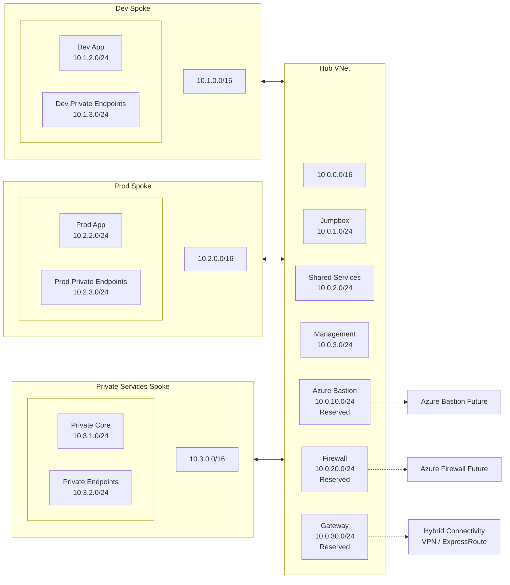

## Azure Landing Zone Network Plan

## Purpose

This document defines the IP addressing and subnet layout for the Azure landing zone.

The goal is to create a clear, scalable, and conflict-free network design that supports:
- hub-and-spoke topology
- environment isolation
- future private service connectivity
- future hybrid connectivity
- phased deployment from proof of concept to enterprise expansion

## Addressing Strategy

The landing zone uses a segmented private IP design with separate address spaces for the hub and each spoke.

The following principles are applied:
- each major zone gets its own non-overlapping CIDR block
- development and production are separated at the network boundary
- address space is reserved for future growth
- the design remains simple enough for a low-cost proof of concept

## Proposed Virtual Network CIDRs

- Hub VNet: `10.0.0.0/16`
- Dev Spoke VNet: `10.1.0.0/16`
- Prod Spoke VNet: `10.2.0.0/16`
- Private Services Spoke VNet: `10.3.0.0/16`
- CI/CD Spoke VNet: `10.4.0.0/16`
- Future Expansion / Reserved: `10.5.0.0/16` and above

## Hub VNet Subnet Plan

Hub VNet CIDR: `10.0.0.0/16`

Proposed hub subnets:

- `10.0.1.0/24` - `snet-jumpbox`
- `10.0.2.0/24` - `snet-shared-services`
- `10.0.3.0/24` - `snet-management`
- `10.0.10.0/24` - `snet-azurebastion` reserved
- `10.0.20.0/24` - `snet-firewall` reserved
- `10.0.30.0/24` - `snet-gateway` reserved

### Notes
- `snet-jumpbox` is used in Phase 1 for a small Linux administrative VM.
- `snet-shared-services` is a placeholder for shared platform services.
- `snet-management` can be used later for platform management components.
- Bastion, Firewall, and Gateway subnets are reserved for future enterprise phases.

## Dev Spoke VNet Subnet Plan

Dev Spoke VNet CIDR: `10.1.0.0/16`

Proposed dev subnets:

- `10.1.1.0/24` - `snet-dev-system`
- `10.1.2.0/24` - `snet-dev-app`
- `10.1.3.0/24` - `snet-dev-private-endpoints`
- `10.1.10.0/24` - `snet-dev-aks-system`
- `10.1.20.0/24` - `snet-dev-data` reserved

### Notes
- `snet-dev-app` is reserved for future application-facing components and internal services that are not AKS nodes.
- `snet-dev-private-endpoints` is reserved for private endpoints used by platform services.
- `snet-dev-aks-system` is the dedicated AKS node subnet for the Phase 2 dev cluster.
- The AKS subnet is intentionally separated from the app subnet for cleaner platform boundaries.
## Prod Spoke VNet Subnet Plan

Prod Spoke VNet CIDR: `10.2.0.0/16`

Proposed prod subnets:

- `10.2.1.0/24` - `snet-prod-system`
- `10.2.2.0/24` - `snet-prod-app`
- `10.2.3.0/24` - `snet-prod-private-endpoints`
- `10.2.10.0/24` - `snet-prod-data` reserved

### Notes
- Production uses its own dedicated address space for stronger isolation.
- The structure mirrors development for operational consistency.
- Private endpoint usage is separated from general app placement.

## Private Services Spoke VNet Subnet Plan

Private Services Spoke VNet CIDR: `10.3.0.0/16`

Proposed private services subnets:

- `10.3.1.0/24` - `snet-private-core`
- `10.3.2.0/24` - `snet-private-endpoints`
- `10.3.10.0/24` - `snet-private-data` reserved

### Notes
- This spoke is intended for internal platform services such as Key Vault, Storage, and databases.
- In Phase 1, this area may be represented by a single private service example only.
- The dedicated private endpoint subnet keeps service access patterns easier to reason about.

## CI/CD Spoke VNet Subnet Plan

CI/CD Spoke VNet CIDR: `10.4.0.0/16`

Proposed CI/CD subnets:

- `10.4.1.0/24` - `snet-runners`
- `10.4.2.0/24` - `snet-build-agents`
- `10.4.10.0/24` - `snet-cicd-management` reserved

### Notes
- This spoke is future-state only.
- It is intended for private runners, build agents, and deployment tooling.
- It is kept separate from application spokes to reduce cross-domain coupling.

## Phase 1 Network Scope

The initial proof of concept will deploy only a small subset of the target network plan.

Included in Phase 1:
- Hub VNet: `10.0.0.0/16`
- One spoke VNet: `10.1.0.0/16`
- `snet-jumpbox` in hub
- `snet-shared-services` in hub
- `snet-dev-app` in dev spoke
- optional `snet-dev-private-endpoints` if a private service example is implemented
- VNet peering between hub and dev spoke

Not deployed in Phase 1:
- Prod spoke
- CI/CD spoke
- Firewall subnet usage
- Gateway subnet usage
- Bastion deployment
- Hybrid connectivity

## Network Design Rules

The following rules guide the design:

- no overlapping CIDR ranges between VNets
- development and production remain in separate VNets
- private connectivity is planned explicitly, not added ad hoc
- shared access services are centralized in the hub
- future enterprise services receive reserved subnet space early
- Phase 1 remains intentionally small to reduce cost and complexity

## Summary Table

| Zone | VNet CIDR | Subnet | CIDR | Purpose |
|---|---|---|---|---|
| Hub | `10.0.0.0/16` | `snet-jumpbox` | `10.0.1.0/24` | Admin access VM |
| Hub | `10.0.0.0/16` | `snet-shared-services` | `10.0.2.0/24` | Shared platform services |
| Hub | `10.0.0.0/16` | `snet-management` | `10.0.3.0/24` | Future management services |
| Hub | `10.0.0.0/16` | `snet-azurebastion` | `10.0.10.0/24` | Reserved |
| Hub | `10.0.0.0/16` | `snet-firewall` | `10.0.20.0/24` | Reserved |
| Hub | `10.0.0.0/16` | `snet-gateway` | `10.0.30.0/24` | Reserved |
| Dev | `10.1.0.0/16` | `snet-dev-system` | `10.1.1.0/24` | Future platform components |
| Dev | `10.1.0.0/16` | `snet-dev-app` | `10.1.2.0/24` | App workloads |
| Dev | `10.1.0.0/16` | `snet-dev-private-endpoints` | `10.1.3.0/24` | Private endpoint usage |
| Prod | `10.2.0.0/16` | `snet-prod-system` | `10.2.1.0/24` | Future platform components |
| Prod | `10.2.0.0/16` | `snet-prod-app` | `10.2.2.0/24` | App workloads |
| Prod | `10.2.0.0/16` | `snet-prod-private-endpoints` | `10.2.3.0/24` | Private endpoint usage |
| Private Services | `10.3.0.0/16` | `snet-private-core` | `10.3.1.0/24` | Core internal services |
| Private Services | `10.3.0.0/16` | `snet-private-endpoints` | `10.3.2.0/24` | Private endpoint usage |
| CI/CD | `10.4.0.0/16` | `snet-runners` | `10.4.1.0/24` | Private runners |
| CI/CD | `10.4.0.0/16` | `snet-build-agents` | `10.4.2.0/24` | Build/deploy agents |

## Summary

> This network plan provides a clean and scalable addressing model for the landing zone.
> It supports a low-cost Phase 1 proof of concept while reserving enough structure for future enterprise expansion into private AKS, centralized security controls, and hybrid connectivity.