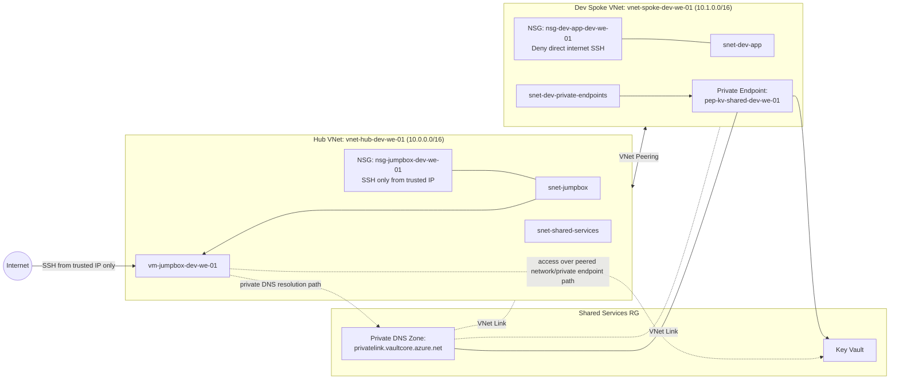

# Day 10 Notes

## Completed
- Implemented private service example module
- Deployed shared services resource group
- Deployed Azure Key Vault
- Deployed private endpoint into dev private-endpoints subnet
- Verified private-service architecture pattern in Azure

## Key outcome
The landing zone now includes a private-service example, extending the architecture beyond networking and compute into private platform service connectivity.

## Deployed resources
- rg-shared-services-dev
- Key Vault
- Private Endpoint in snet-dev-private-endpoints

# Day 10 Step 2 Notes

## Completed
- Implemented Private DNS support for the Key Vault private endpoint
- Created the private DNS zone for Key Vault private link
- Linked the private DNS zone to the hub VNet
- Linked the private DNS zone to the dev spoke VNet
- Attached the private endpoint to the private DNS zone using a DNS zone group
- Extended the landing zone from basic private endpoint deployment to private name resolution support

## Key outcome
The landing zone now supports private DNS resolution for the Key Vault private endpoint, making the private-service design more realistic and aligned with enterprise private-access architecture.

## Implemented resources
- Private DNS zone: privatelink.vaultcore.azure.net
- Hub VNet link to private DNS zone
- Dev spoke VNet link to private DNS zone
- Private DNS zone group on the Key Vault private endpoint

## Architectural value
This step completed the missing DNS layer required for a functional private endpoint pattern.
The environment now includes:
- hub-and-spoke networking
- secured jumpbox access
- Key Vault private endpoint
- private DNS integration

## Next recommended hardening step
- Validate private name resolution from the jumpbox
- Then disable public network access on the Key Vault after confirming private resolution works

## Next step
Day 11 will focus on documentation cleanup, diagram updates, and aligning the repo with the deployed PoC state.
