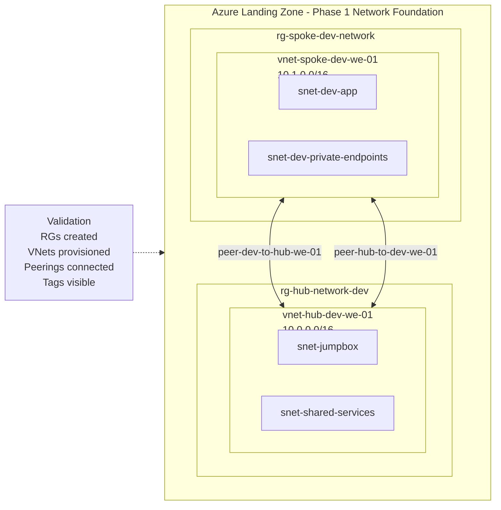

# Day 7 Notes

Successfully deployed the Phase 1 Azure landing zone network foundation using Terraform.

Deployed components:
- rg-hub-network-dev
- rg-spoke-dev-network
- vnet-hub-dev-we-01 (10.0.0.0/16)
- vnet-spoke-dev-we-01 (10.1.0.0/16)
- hub subnets:
  - snet-jumpbox
  - snet-shared-services
- dev spoke subnets:
  - snet-dev-app
  - snet-dev-private-endpoints
- bidirectional VNet peering:
  - peer-hub-to-dev-we-01
  - peer-dev-to-hub-we-01

Validation:
- resource groups created successfully
- VNets provisioned successfully
- peerings are connected and fully in sync
- Terraform tags are visible in Azure

## Completed
- Logged into Azure with Azure CLI
- Verified the active subscription
- Initialized Terraform
- Validated the configuration
- Reviewed the first network plan
- Applied the Phase 1 network foundation
- Verified resource groups, VNets, subnets, and peerings

## Key outcome
The Azure landing zone PoC now has a real deployed network foundation in Azure.

## Deployed resources
- rg-hub-network-dev
- rg-spoke-dev-network
- vnet-hub-dev-we-01
- vnet-spoke-dev-we-01
- snet-jumpbox
- snet-shared-services
- snet-dev-app
- snet-dev-private-endpoints
- peer-hub-to-dev-we-01
- peer-dev-to-hub-we-01

## Next step
Day 8 will add the first NSG controls and tighten the network baseline.
